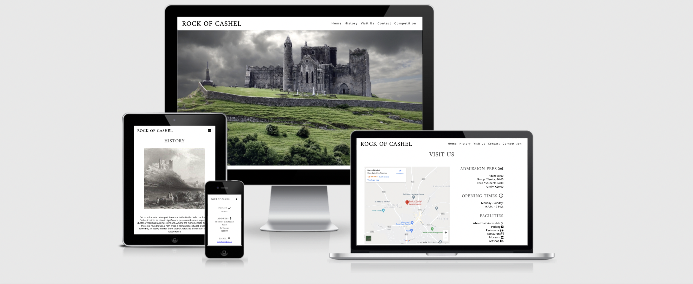

# Rock Of Cashel



---

[Live Website](https://conorwalsh1.github.io/Portfolio-Project-1/)

[Github Repository](https://github.com/conorwalsh1/Portfolio-Project-1)

---

# About

I wanted to build a website for a tourist attraction in my local town, 'The Rock of Cashel'. The website is made to target both tourists and locals. To achieve this, I aimed to lay out the website in a clear and concise way. 

As most visitors to the 'Rock of Cashel' would be tourists from out of town, I prioritised a landing page comprised of an impressive photo of the rock with a clear and simple navigation bar at the top alongside the header to steer site browsers in the right direction. The History section appears first with a brief but thorough description of the Rocks' past which also includes an image of the rock from olden times. Following this is a 'Visit Us' section which includes an Google Maps iframe along with admission fees, opening times and facilities available on site. 

At the bottom of the page I included all relevant contact information with all social media links included in the footer. I added two divider images, one under the History section of a tapestry and one under the Visit Us section. The image of the rock under the Visit Us section is taken at sunset which I felt was relevant as the visitor also approaches the end of the web page. The color scheme in both divider images are cohesive and they compliment eachother, whilst the landing page image is an impressive picture of the rock with the predominantly grey and green offering a striking effect. 

The competition page is pitched as a local photo competition for pictures of the rock. I added this to the end of the navigation bar as locals would make up a significantly less amount of visitors on the website. I also wanted to keep the main landing page kept exclusively for easily digestable information on the rock itself.

## User Experience (UX)

-   ### User stories

    -   #### First Time Visitor Goals

        1. As a First Time Visitor, I want to easily understand the main purpose of the site and learn more about the history of the 'Rock Of Cashel' whilst also understanding how to get there. I also want to know what facilities the location has to offer if I were to visit.
        2. As a First Time Visitor, I want to be able to easily navigate throughout the site to find content.
        3. As a First Time Visitor, I want to make sure all relevant contact information is available if required. I also want to locate their social media links to see their followings on social media to determine how trusted and known they are.

    -   #### Returning Visitor Goals

        1. As a Returning Visitor, I want to find the results for the seasonly photo competitions.
        2. As a Returning Visitor, I want to find the best way to get in contact with the organisation with any questions I may have.
        3. As a Returning Visitor, I want to find out what the current prcies are for admission and what times is the 'Rock of Cashel' open for visits and tours.

    -   #### Frequent User Goals
        1. As a Frequent User, I want to check to see the results for the photo competition in more detail, including amount of total votes and percentages on what entry garnered the most votes.
        2. As a Frequent User, I want to check to see if there are any changes to admission prices, opening times or facilities.
        3. As a Frequent User, I want to see any new updates the site has posted through their social media links.

-   ### Design
    -   #### Colour Scheme
        -   The main colours used are grey, green, orange and blue.
    -   #### Typography
        -   The Amiri font is used for any headers or titles whilst Open Sans is the main font used throughout the whole website with Sans Serif as the fallback font in case for any reason the font isn't being imported into the site correctly. Amiri and Open Sans are both distinguished and legible fonts, Amiri being extremely effective in titles as it has an elegant charm.
    -   #### Imagery
        -   Imagery is a key component of my sites make up. The landing image shows the 'Rock of Cashel' in all of it's glory with the contrast of the grey really popping against the green grass. Futher down the site I use two images that cover the page fully in width but only about a third of the page in height. They act as dividing images to break the flow of the page. They both harbour warm colors which trigger a positive emotional reaction in the site browser. I chose the second divider image set above the 'Contact' div specifically as it shows the 'Rock' at sunset, illustrating to the site browser that they are reaching the end of the page. 
        
            I created a second page on the site under the 'Competition' link in the navigation bar which is made up mostly of imagery. The link will bring the site browser to the results page of a seasonaly run photo competition where members of the public vote on what they believe is the most impressive picture submitted and the prize winner is allocated a sum of €250. Imagery is an important part of the website as these exquisite images show how colossal the 'Rock' is, reminiding locals who have grown accustomed to living in the shadow of the 'Rock' how lucky they are to live so close to it, whilst encouraging tourists from both within and outside Ireland to come visit to see it in all its majesty for themselves.

*   ### Wireframes

    -   I chose to sketch the layout of the site using paper and pencil and made adjustments along the way.

## Features

-   Responsive on all device sizes. On wider screens the navigation bar lists all different sections side by side, but once screen size is restricted, the nav links shrink into a burger icon which collapses when clicked and shows relevant links.

-   The navigation bar and logo within the header are fixed, meaning no matter how far the site browser scrolls throughout the page, they can access any part of the web site at any time.

-   When hovered over, the navigation links display a black underline giving the site browser more clarity.

-   Accessibility has been added in terms of both aria labels and aria labelled by to ensure the site is usable for anyone using screen readers.

-   Icons imported from Font Awesome and applied where necessary (e.g applied to all list items under Visit Us and Contact divs).

-   History, Visit Us and Contact sections on the home page. Competition makes up a second seperate page.

-  Visit Us page hosts relevant admission prices, opening times and facilities on site. It also has Google Maps implemented through iframe, updated in real time.

-   Contact page hosts relevant phone number, geographical address and email address.

-   The email address at the bottom of the page opens up into a new email when clicked, with the 'Rock of Cashel' listed as the intended recipient.

-   The footer contains links to social media sites, where site browsers can gain access to recent updates from 'The Rock of Cashel' tourist site.

-   Social media links have been colour coded with the exact RGB of each relevant site to ensure familiarty for the site browser.

-   Competition page hosts information about upcoming photo competitions in terms of when to enter by and when voting opens. It also hosts results from the most recent vote, showing the picture entered, who took the picture, how many votes the picture got and what percentage of the total number of votes the respective picture received.


## Technologies Used

### Languages Used

-   [HTML5](https://en.wikipedia.org/wiki/HTML5)
-   [CSS3](https://en.wikipedia.org/wiki/Cascading_Style_Sheets)

### Frameworks, Libraries & Programs Used

1. [Google Fonts:](https://fonts.google.com/)
    - Google fonts were used to import the 'Amiri' font into the style.css file which is used on all pages throughout the project.
1. [Font Awesome:](https://fontawesome.com/)
    - Font Awesome was used on all pages throughout the website to add icons for aesthetic and UX purposes.
1. [Git](https://git-scm.com/)
    - Git was used for version control by utilizing the Gitpod terminal to commit to Git and Push to GitHub.
1. [GitHub:](https://github.com/)
    - GitHub is used to store the projects code after being pushed from Git.
1. [Google Maps:](https://www.google.com/maps)
    - Google Maps was used to display information on how to get to the 'Rock of Cashel'.
1. [Responsive Design:](http://ami.responsivedesign.is/)
    - Responsive design was used to create responsive design imitator image.


## Testing

The W3C Markup Validator and W3C CSS Validator Services were used to validate every page of the project to ensure there were no syntax errors in the project.

-   [W3C Markup Validator](https://jigsaw.w3.org/css-validator/#validate_by_input) - [Results](https://github.com/)
-   [W3C CSS Validator](https://jigsaw.w3.org/css-validator/#validate_by_input) - [Results](https://github.com/)

### Testing User Stories from User Experience (UX) Section

-   #### First Time Visitor Goals

    1. As a First Time Visitor, I want to easily understand the main purpose of the site and learn more about the organisation.

        1. Upon entering the site, users are automatically greeted with a clean and easily readable navigation bar to go to the page of their choice. Underneath there is an undistracting Hero Image of the 'Rock'.
        2. The main points are made immediately with the hero image
        3. The user has two options, click on the nav links or scroll down, both of which will lead to the same place, to learn more about the 'Rock of Cashel'.

    2. As a First Time Visitor, I want to be able to easily be able to navigate throughout the site to find content.

        1. The site has been designed to be fluid and never to entrap the user. At the top of each page there is a clean navigation bar, each link describes what the page they will end up at clearly.
        2. At the bottom of the first 3 pages there is a redirection call to action to ensure the user always has somewhere to go and doesn't feel trapped as they get to the bottom of the page.
        3. On the Contact Us Page, after a form response is submitted, the page refreshes and the user is brought to the top of the page where the navigation bar is.

    3. As a First Time Visitor, I want to look for testimonials to understand what their users think of them and see if they are trusted. I also want to locate their social media links to see their following on social media to determine how trusted and known they are.

        1. Once the new visitor has read the History and Visit Us, they will notice the Contact section.
        2. The user can also scroll directly to the bottom of any page on the site to locate social media links in the footer.
        3. At the bottom of the Contact Us page in the footer, the user is told that alternatively they can contact the organisation on social media which highlights the links to them.

-   #### Returning Visitor Goals

    1. As a Returning Visitor, I want to find information on the most recent photo competition.

        1. The competition link will always sit in the fixed header, meaning the site browser need never look far to gain access.
        2. They will be directed to a page with a description on what event is ongoing, when voting is open and who can they contact for any further information.
        3. The pictures entered in the competition will be listed below.

    2. As a Returning Visitor, I want to find the best way to get in contact with the organisation with any questions I may have.

        1. The navigation bar clearly highlights the "Contact" Page.
        2. Here they can gather our phone number and email or are told that alternatively they can message the organisation on social media.
        3. The footer contains links to the organisations Facebook, Twitter, Instagram and Youtube pages.
        4. Whichever link they click, it will be open up in a new tab to ensure the user can easily get back to the website.
        5. The email button is set up to automatically open up your email app and autofill there email address in the "To" section.

    3. As a Returning Visitor, I want to find the Facebook link so that I can join and interact with others in the community.
        1. The Facebook Page can be found at the footer of every page and will open a new tab for the user and more information can be found on the Facebook page.

-   #### Frequent User Goals

    1. As a Frequent User, I want to check to see if there are any new details about the photo competition.

        1. The user would already be comfortable with the website layout and can easily click the banner message.

    2. As a Frequent User, I want to check to see if there are any changes in admission prices or opening times.

        1. The user would already be comfortable with the website layout and can easily click the Visit Us link

### Further Testing

-   The Website was tested on Google Chrome, Internet Explorer, and Safari browsers.
-   The website was viewed on a variety of devices such as Desktop, Laptop, iPad, iPhone7, & iPhoneX.
-   A large amount of testing was done to ensure that all pages were linking correctly.
-   Friends and family members were asked to review the site and documentation to point out any bugs and/or user experience issues.

### Known Bugs

-   When the nav bar is opened through the collapsible burger icon on iPhones and iPad, the links for History, Visit Us and Contact divs will bring the user to the relevant part of the site, however they must close the drop down using the "X" icon on the top right of the page to display the information as requested. The issue does not effect Home or Competition links.

-

## Deployment

### GitHub Pages

The project was deployed to GitHub Pages using the following steps...

1. Log in to GitHub and locate the [GitHub Repository](https://github.com/)
2. At the top of the Repository (not top of page), locate the "Settings" Button on the menu.
    - Alternatively Click [Here](https://raw.githubusercontent.com/) for a GIF demonstrating the process starting from Step 2.
3. Scroll down the Settings page until you locate the "GitHub Pages" Section.
4. Under "Source", click the dropdown called "None" and select "Master Branch".
5. The page will automatically refresh.
6. Scroll back down through the page to locate the now published site [link](https://github.com) in the "GitHub Pages" section.

### Forking the GitHub Repository

By forking the GitHub Repository we make a copy of the original repository on our GitHub account to view and/or make changes without affecting the original repository by using the following steps...

1. Log in to GitHub and locate the [GitHub Repository](https://github.com/)
2. At the top of the Repository (not top of page) just above the "Settings" Button on the menu, locate the "Fork" Button.
3. You should now have a copy of the original repository in your GitHub account.

### Making a Local Clone

1. Log in to GitHub and locate the [GitHub Repository](https://github.com/)
2. Under the repository name, click "Clone or download".
3. To clone the repository using HTTPS, under "Clone with HTTPS", copy the link.
4. Open Git Bash
5. Change the current working directory to the location where you want the cloned directory to be made.
6. Type `git clone`, and then paste the URL you copied in Step 3.

```
$ git clone https://github.com/YOUR-USERNAME/YOUR-REPOSITORY
```

7. Press Enter. Your local clone will be created.

```
$ git clone https://github.com/YOUR-USERNAME/YOUR-REPOSITORY
> Cloning into `CI-Clone`...
> remote: Counting objects: 10, done.
> remote: Compressing objects: 100% (8/8), done.
> remove: Total 10 (delta 1), reused 10 (delta 1)
> Unpacking objects: 100% (10/10), done.
```

Click [Here](https://help.github.com/en/github/creating-cloning-and-archiving-repositories/cloning-a-repository#cloning-a-repository-to-github-desktop) to retrieve pictures for some of the buttons and more detailed explanations of the above process.

## Credits

### Code

-   The full-screen hero image code came from this [StackOverflow post](https://stackoverflow.com)

-   [Bootstrap4](https://getbootstrap.com/docs/4.4/getting-started/introduction/): Bootstrap Library used throughout the project mainly to make site responsive using the Bootstrap Grid System.

-   [MDN Web Docs](https://developer.mozilla.org/) : For Pattern Validation code. Code was modified to better fit my needs and to match an Irish phone number layout to ensure correct validation. Tutorial Found [Here](https://developer.mozilla.org/en-US/docs/Web/HTML/Element/input/tel#Pattern_validation)

### Content

-   All content was written by the developer.

-   Psychological properties of colours text in the README.md was found [here](http://www.colour-affects.co.uk/psychological-properties-of-colours)

### Media

-   All Images were created by the developer.

### Acknowledgements

-   My Mentor for continuous helpful feedback.

-   Tutor support at Code Institute for their support.

Created new HTML and CSS files

Added description and added relevant keywords

Added title "Rock of Cashel"

Added header, section and footer to the body element

Imported Amiri font from Google Fonts as it had a classic looks which I felt fitted well with a website based on a historical site

Applied black font to make it stand out against lighter shade background

Added three section elements: one for main image, one for history section and one for visit us section

Added nav links within header element for Home, History, Visit Us and Competition 

Styled navigation links so they were more compatible with the logo. I also played around with different font sizes and letter spacing to see what would suit best.

Found it difficult to crop the picture to a size that fitted the page but was happy after going through some trial and error with the result

Added the section 'History' which included information about the Rock of Cashel. I created a set of paragraphs for the text with line breaks between. I also added the class "history" to edit in css.

Matched the font size of the 'History' title with that of the logo and used the same margins.

Alligned the picture in the 'history' section to the right and wrapped text around it. I struggled to wrap the text around the picture at first but found relevant information on https://www.uvm.edu/~bnelson/computer/css/wrappingtextaroundimages.html

Created a third section titled Visit Us

Placed image between History and Visit Us to divide the flow

Added internal nav link for history nav bar at top of page using information sourced from https://www.computerhope.com/issues/ch000049.htm

Added iframe for Google Maps with the location set to that of 'The Rock of Cashel'

Added Admission Prices and Opening times beside map

Added font awesome script to add icons 

Added list of facilities under opening times, besdie map

Added relevant icons to all Visit us lists

Added evening picture of 'Rock of Cashel' to alert coming to end of page

First picture I attempted was too large so I decided to use one that covered width but not the height

Added inline block element after reading back over lesson on block elements

Added social media icons in footer. I acquired accurate colors using https://brandpalettes.com/

Put the banner image above 'Visit Us' into it's own section as I wanted tp put a hover text overlay css style over it

Followed tutorial here https://www.youtube.com/watch?v=exb2ab72Xhs to acheive hover transition effect over tapestry image

After spending a bit of time acheieving the desired effect, I decided it was taking too much time when I started to adjust the layout for different screen sizes so instead I opted to add text directly to image and reupload.

I alligned the contact info verically as opposed to horizontally to improve display clarity on smaller screens

Add media queries for each relevant screen size where content morphed out of shape

Followed first part of tutorial using https://www.youtube.com/watch?v=S-JyJCVx_4Y to figure out how to add fixed nav bar. I tried to follow the video futher as I wanted to create a burger icon to shrink the menu when the screen size was reduced but after multiple attempts I had to give up as it was not turning out like the video and was taking up a lot of time.

I found my fixed nav bar kept disappearing behind images as I scrolled through page. Searched online and found https://stackoverflow.com/questions/29451382/navigation-bar-being-hidden-behind-pics which recommended setting z-index to a high figure which solved problem.

Though I spent a lot of time earlier on trying to find a way to make the burger icon work, I felt it would really help the flow of the site as I had four nav anchors whiich took up a lot of space once screen sizes got smaller, so I followed a tutorial https://www.youtube.com/watch?v=AkK8yHC4TlI and managed to get it working.

I added a photo competition page to highlight some of the impressive imagery of the rock of cashel that is aimed at both tourists and locals. I set it up as a posting page for results of a competition that had just passed with voting left open to members of the public. The total amount of votes is listed, along with competition winner, the winning prize amount and information about the next competition and when to enter by. 

I posted images of the five entries, along with the submitters name, the amount of votes they received and also what percentage went to each contestant. I adjusted the media queries for the page for responsiveness across all screen sizes.

I wanted to have it so when you click on the email in the Contact section it opened a new email with the Rock of Cashel email already named as the recipient, si I followed the tutorial on https://css-tricks.com/all-about-mailto-links/ to achieve.

Add aria label and aria labelledby to all relevant places to improve accessibility throughout the site

I removed any unnecessary spaces to make sure code is clean troughout CSS and HTML

Renamed image files to make them all clearer and removed any capital letters to enable cross platform compatibility 

Removed unnecessary comments

Once I had completed everything I was left unsatisfied after numerous attempts of playing with the code I could not get the burger item to display the drop down nav list vertically. In the video I used to get to that point, the coder used display: block to align the nav links vertically, but it would not work the same on my system. I decided to give it one more attempt to fix it as it was the only part of the project I was left unsatisfied with. I used Chrome Dev Tools to play around with different display attributes and found that 'grid' alligned the nav list vertically, but the spacing was too far apart and it was inverted. I then tried display flex which seemed to work better. It also gave me options such as flex direction and justify content to play around with and I was able to obtain the desired layout. I then tweaked the line height and list margin until I alligned the list in the desired.


Welcome conorwalsh1,

This is the Code Institute student template for Gitpod. We have preinstalled all of the tools you need to get started. You can safely delete this README.md file, or change it for your own project. Please do read it at least once, though! It contains some important information about Gitpod and the extensions we use.

## Gitpod Reminders

To run a frontend (HTML, CSS, Javascript only) application in Gitpod, in the terminal, type:

`python3 -m http.server`

A blue button should appear to click: _Make Public_,

Another blue button should appear to click: _Open Browser_.

To run a backend Python file, type `python3 app.py`, if your Python file is named `app.py` of course.

A blue button should appear to click: _Make Public_,

Another blue button should appear to click: _Open Browser_.

In Gitpod you have superuser security privileges by default. Therefore you do not need to use the `sudo` (superuser do) command in the bash terminal in any of the lessons.

To log into the Heroku toolbelt CLI you can use:

`heroku login -i`

If you have Multi-Factor Authentication (MFA) enabled then use the API key that was generated for you at [Heroku](https://dashboard.heroku.com/account) as your password.
This API key is unique and private to you so do not share it. If you accidently make it public then you can create a new one with _Regenerate API Key_.

## Updates Since The Instructional Video

We continually tweak and adjust this template to help give you the best experience. Here is the version history:

**October 21 2020:** Versions of the HTMLHint, Prettier, Bootstrap4 CDN and Auto Close extensions updated. The Python extension needs to stay the same version for now.

**October 08 2020:** Additional large Gitpod files (`core.mongo*` and `core.python*`) are now hidden in the Explorer, and have been added to the `.gitignore` by default.

**September 22 2020:** Gitpod occasionally creates large `core.Microsoft` files. These are now hidden in the Explorer. A `.gitignore` file has been created to make sure these files will not be committed, along with other common files.

**April 16 2020:** The template now automatically installs MySQL instead of relying on the Gitpod MySQL image. The message about a Python linter not being installed has been dealt with, and the set-up files are now hidden in the Gitpod file explorer.

**April 13 2020:** Added the _Prettier_ code beautifier extension instead of the code formatter built-in to Gitpod.

**February 2020:** The initialisation files now _do not_ auto-delete. They will remain in your project. You can safely ignore them. They just make sure that your workspace is configured correctly each time you open it. It will also prevent the Gitpod configuration popup from appearing.

**December 2019:** Added Eventyret's Bootstrap 4 extension. Type `!bscdn` in a HTML file to add the Bootstrap boilerplate. Check out the <a href="https://github.com/Eventyret/vscode-bcdn" target="_blank">README.md file at the official repo</a> for more options.

---

Happy coding!
